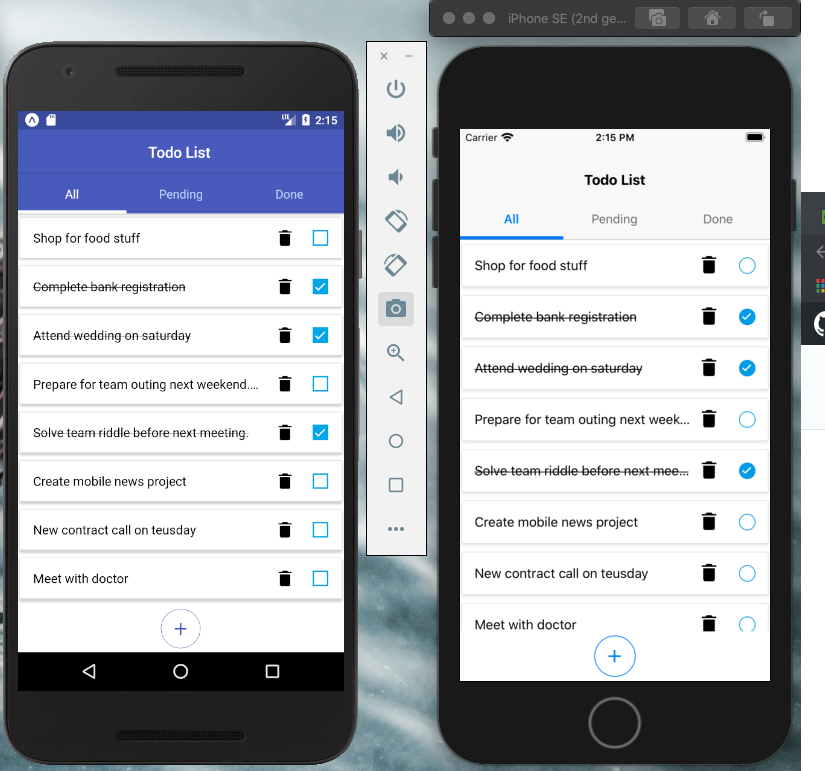
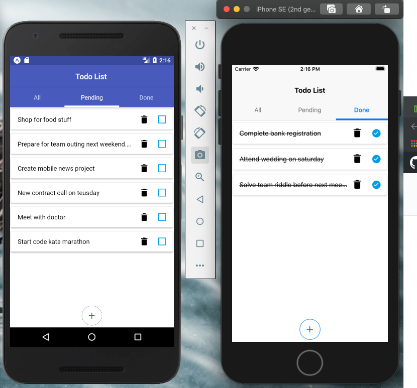
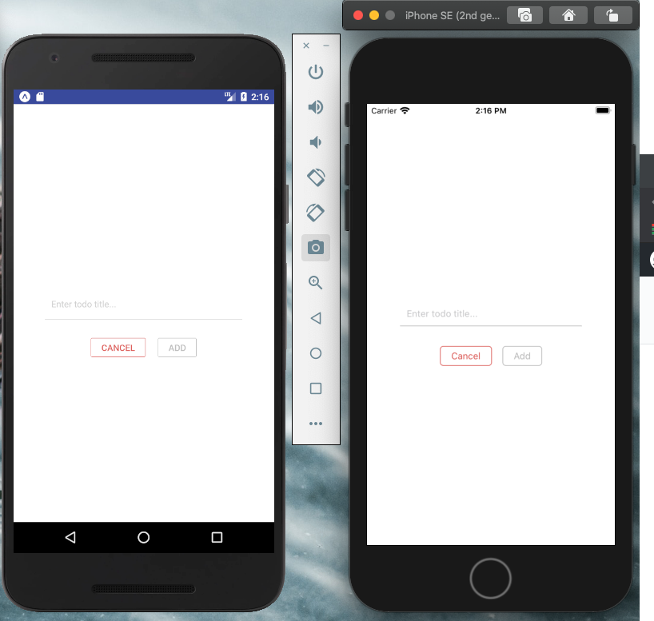

## Yet another Todo app with React Native scafolded with expo-cli

### To use the app

- Go to the project root, and run `npm install` or `yarn`
- Then do `npm start`

### Screens

#### HomeScreen

#### Pending And Done Todo Tab

#### Add Todo Modal

